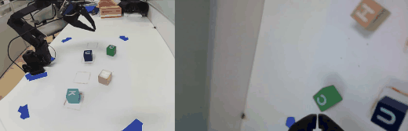

# Recoverable VLA LoRA Stacking

Clean experiment code for prompted curriculum learning and LoRA stacking on the
SO101 CUHK letter-sorting benchmark. It includes scripts for SO101 teleoperation,
demonstration recording, dataset construction, pi0.5 LoRA training, LoRA
stacking, and real-robot deployment.

This repository accompanies the final project for **CUHKSZ CSC6052: Natural
Language Processing**, Spring 2026.

## Demo Videos

[](https://doi.org/10.5281/zenodo.20058809)

Full archive: https://doi.org/10.5281/zenodo.20058809

## Layout

- `control_scripts/`: experiment wrappers for hardware setup, SO101 teleop,
  dataset recording, dataset aggregation, OpenPI pi0.5 LoRA training, watchdog
  monitoring, and deployment.
- `openpi/`: OpenPI source snapshot used by the experiments.  The important
  project-specific files are:
  - `openpi/src/openpi/policies/so101_policy.py`
  - `openpi/src/openpi/training/config.py`
  - `openpi/src/openpi/training/data_loader.py`
  - `openpi/scripts/train.py`
  - `openpi/scripts/compute_norm_stats.py`
  - `openpi/scripts/serve_policy.py`
- `lora_stacking.py`: weight-space Curriculum LoRA Stacking exporter.
- `test_lora_stacking.py`: lightweight tests for the stacking math.

## Main Workflow

All commands below assume the repository root is this cloned repository. The
original experiment scripts default to the lab paths used during data
collection; override the environment variables when running on a different
machine.

### 1. Teleoperate SO101

```bash
OPENPI_DIR="$PWD/openpi" \
bash control_scripts/08_teleoperate_so101.sh
```

### 2. Record Demonstrations

Single-letter boxed pick-and-place:

```bash
bash control_scripts/24_record_cuhk_pick_place_slots.sh all
```

Recovery and augmentation stages:

```bash
bash control_scripts/33_record_cuhk_stage3_swap_recovery.sh
bash control_scripts/42_record_cuhk_stage4_two_random_two_fixed.sh
bash control_scripts/43_record_cuhk_stage4_near_slot_alignment.sh
```

### 3. Build Aggregated Datasets

```bash
bash control_scripts/39_build_stage3_curated_swap_x2_dataset.sh
bash control_scripts/44_build_stage4_s2_recovery_x1_stage4_x4_dataset.sh
```

### 4. Train pi0.5 LoRA Policies

Stage 3 curated recovery:

```bash
OPENPI_DIR="$PWD/openpi" \
PYTHON_BIN="$PWD/openpi/.venv/bin/python" \
bash control_scripts/40_train_openpi_stage3_curated_swap_x2.sh
```

Stage 4 recovery/alignment continuation:

```bash
OPENPI_DIR="$PWD/openpi" \
PYTHON_BIN="$PWD/openpi/.venv/bin/python" \
bash control_scripts/45_train_openpi_stage4_s2_recovery_x1_stage4_x4.sh
```

The configs used by these launchers live in
`openpi/src/openpi/training/config.py`.

### 5. Export LoRA Stacking Checkpoint

```bash
PYTHONPATH="$PWD/openpi/src" python lora_stacking.py \
  --adapter stage2=/path/to/stage2/50000/params \
  --adapter stage3=/path/to/stage3/49999/params \
  --adapter stage4=/path/to/stage4/49999/params \
  --alpha stage2=0.45 --alpha stage3=0.35 --alpha stage4=0.20 \
  --adapter-mode sequential-delta \
  --output-checkpoint /path/to/stacked_checkpoint \
  --overwrite
```

Use `sequential-delta` for this project's continuation checkpoints.  It
recovers the explicit stage updates as `stage2`, `stage3 - stage2`, and
`stage4 - stage3` before applying the simplex weights.

### 6. Deploy pi0.5 on SO101

```bash
OPENPI_DIR="$PWD/openpi" \
OPENPI_PYTHON="$PWD/openpi/.venv/bin/python" \
OPENPI_CONFIG=pi05_so101_cuhksz_stage4_s2_recovery_x1_stage4_x4_lora \
OPENPI_CHECKPOINT=/path/to/checkpoint \
bash control_scripts/25_deploy_openpi_pi05_so101.sh \
  "Sort the visible CUHK letter blocks into the lower target slots in left-to-right order C, U, H, K."
```

The same deployment script can serve a stacked checkpoint by setting
`OPENPI_CHECKPOINT=/path/to/stacked_checkpoint`.

## Quick Checks

```bash
python -m pytest test_lora_stacking.py -q
bash -n control_scripts/*.sh
python -m py_compile lora_stacking.py control_scripts/*.py
```

These checks validate syntax and the standalone LoRA stacking math.  Real
training and deployment require the robot hardware, datasets, OpenPI/LeRobot
runtime dependencies, and the external checkpoints described in the report.
